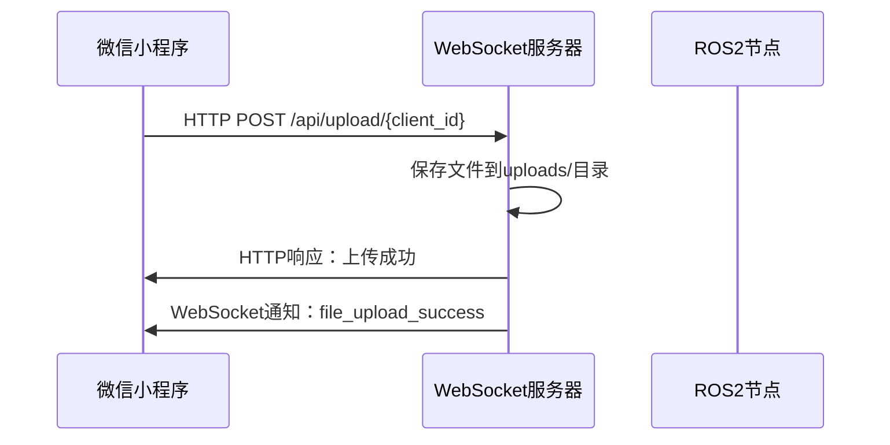
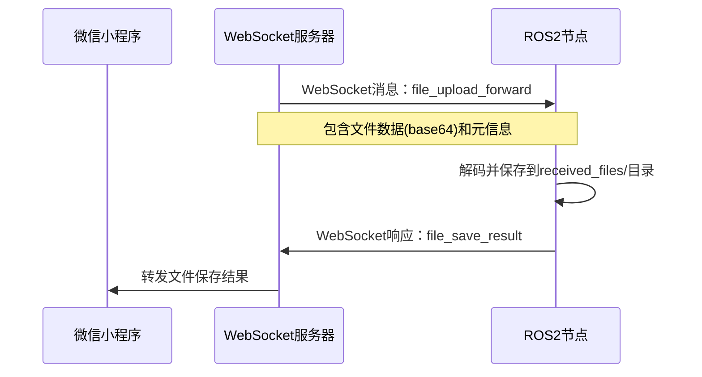

# 文件转发功能使用指南

## 概述

本系统实现了从微信小程序客户端上传文件，通过WebSocket服务器转发到ROS2节点，并在机器人端保存文件的完整流程。

## 系统架构

```
微信小程序客户端 --> HTTP上传 --> WebSocket服务器 --> ROS2节点 --> 文件保存
     ↑                                ↓                           ↓
     └─────────── WebSocket通知 ←──── 文件保存结果 ←────────────────┘
```

## 主要组件

### 1. 服务端 (server.py)
- **HTTP文件上传接口**: `/api/upload/{client_id}`
- **WebSocket消息路由**: 处理客户端和机器人节点之间的通信
- **文件转发功能**: 将上传的文件转发给ROS2节点

### 2. ROS2节点 (websocket_bridge_node.py)
- **WebSocket客户端**: 连接到服务器
- **文件接收处理**: 接收并保存转发的文件
- **特征提取触发**: 对图片/视频文件触发后续处理

### 3. 微信小程序客户端
- **文件上传界面**: 支持选择文件、拍照、录制
- **WebSocket连接**: 接收文件处理状态

## 文件流转过程

### 1. 文件上传阶段


### 2. 文件转发阶段


## 配置说明

### 服务端配置
```python
# 服务器地址和端口
HOST = '172.20.39.181'
WEBSOCKET_PORT = 1234
HTTP_PORT = 1235

# 文件大小限制
MAX_FILE_SIZE = 10 * 1024 * 1024  # 10MB
```

### ROS2节点配置
```python
# WebSocket连接参数
websocket_host = '172.20.39.181'
websocket_port = 1234
robot_id = 'companion_robot_001'

# 文件保存配置
file_save_dir = 'received_files'
max_file_size = 50 * 1024 * 1024  # 50MB
```

## 启动步骤

### 1. 启动WebSocket服务器
```bash
cd flask
python 服务端/server.py
```

### 2. 启动ROS2环境
```bash
# 启动ROS2环境
source /opt/ros/humble/setup.bash
cd flask

# 编译ROS2包
colcon build --packages-select following_robot

# source工作空间
source install/setup.bash

# 启动WebSocket桥接节点
ros2 run following_robot websocket_bridge_node
```

### 3. 测试文件转发功能
```bash
# 运行测试脚本
python test_file_forward.py
```

## 文件保存结构

### 服务端文件保存 (uploads/)
```
uploads/
├── {client_id}_{timestamp}_{filename}
├── test_client_001_1704067200000_image.jpg
└── ...
```

### ROS2节点文件保存 (received_files/)
```
received_files/
├── {timestamp}_{client_id}_{safe_filename}
├── 1704067200000_test_client_001_image.jpg
└── ...
```

## 消息格式

### 文件上传成功通知
```json
{
    "type": "file_upload_success",
    "file_id": "test_client_001_1704067200000_image.jpg",
    "file_name": "image.jpg",
    "file_size": 12345,
    "file_type": "image/jpeg",
    "upload_time": 1704067200000
}
```

### 文件转发消息
```json
{
    "type": "file_upload_forward",
    "robot_id": "companion_robot_001",
    "file_id": "test_client_001_1704067200000_image.jpg",
    "file_name": "image.jpg",
    "file_data_base64": "base64编码的文件数据",
    "file_type": "image/jpeg",
    "file_size": 12345,
    "upload_time": 1704067200000,
    "client_id": "test_client_001",
    "timestamp": 1704067200000
}
```

### 文件保存结果
```json
{
    "type": "file_save_result",
    "status": "success",
    "file_id": "test_client_001_1704067200000_image.jpg",
    "original_name": "image.jpg",
    "saved_path": "/path/to/received_files/1704067200000_test_client_001_image.jpg",
    "saved_size": 12345,
    "client_id": "test_client_001",
    "robot_id": "companion_robot_001",
    "timestamp": 1704067200000
}
```

## 错误处理

### 常见错误及解决方案

1. **文件过大**
   - 错误: `FILE_TOO_LARGE`
   - 解决: 检查文件大小限制配置

2. **客户端未连接**
   - 错误: `CLIENT_NOT_CONNECTED`
   - 解决: 确保WebSocket连接正常

3. **机器人节点未连接**
   - 错误: 文件无法转发到ROS2节点
   - 解决: 检查ROS2节点WebSocket连接状态

4. **文件解码失败**
   - 错误: base64解码失败
   - 解决: 检查文件传输完整性

## 特征提取集成

对于图片和视频文件，系统会自动触发特征提取流程：

1. 文件保存成功后调用 `trigger_feature_extraction()`
2. 可以集成现有的特征提取节点
3. 支持人体特征、服装颜色等多种特征提取

## 性能优化

### 文件传输优化
- 使用base64编码确保二进制文件安全传输
- 支持大文件分块传输（可扩展）
- 文件名安全性处理，防止路径攻击

### 内存管理
- 及时释放文件数据内存
- 异步处理避免阻塞主线程
- 错误处理确保资源清理

## 监控和日志

### 服务端日志
```
📁 文件上传成功 - 客户端: test_client_001, 文件: image.jpg, 大小: 12345字节
📤 文件转发成功 - 机器人: companion_robot_001, 文件: image.jpg, 大小: 12345字节
```

### ROS2节点日志
```
📂 收到文件上传 - 文件: image.jpg, 大小: 12345字节, 来源: test_client_001
✅ 文件保存成功: received_files/1704067200000_test_client_001_image.jpg
🔍 开始特征提取: received_files/1704067200000_test_client_001_image.jpg
```

## 扩展功能

### 1. 文件类型过滤
可以在服务端或ROS2节点添加文件类型检查：
```python
allowed_types = ['image/jpeg', 'image/png', 'video/mp4']
if file_type not in allowed_types:
    # 拒绝处理
```

### 2. 文件去重
基于文件内容哈希值避免重复存储：
```python
import hashlib
file_hash = hashlib.md5(file_data).hexdigest()
```

### 3. 自动清理
定期清理过期文件：
```python
# 删除超过7天的文件
cleanup_older_than = 7 * 24 * 3600  # 7天
```

## 故障排查

### 1. 检查网络连接
```bash
# 测试WebSocket连接
telnet 172.20.39.181 1234

# 测试HTTP接口
curl -X GET http://172.20.39.181:1235/api/health
```

### 2. 检查ROS2环境
```bash
# 检查节点状态
ros2 node list
ros2 node info /websocket_bridge_node

# 查看日志
ros2 log show websocket_bridge_node
```

### 3. 检查文件权限
```bash
# 确保目录可写
ls -la received_files/
chmod 755 received_files/
```

## 总结

本文件转发系统提供了完整的端到端文件传输解决方案，支持从微信小程序到ROS2机器人的无缝文件传输。通过WebSocket实现实时通信，确保文件传输状态的及时反馈，为后续的特征提取和机器人控制提供了可靠的数据基础。 