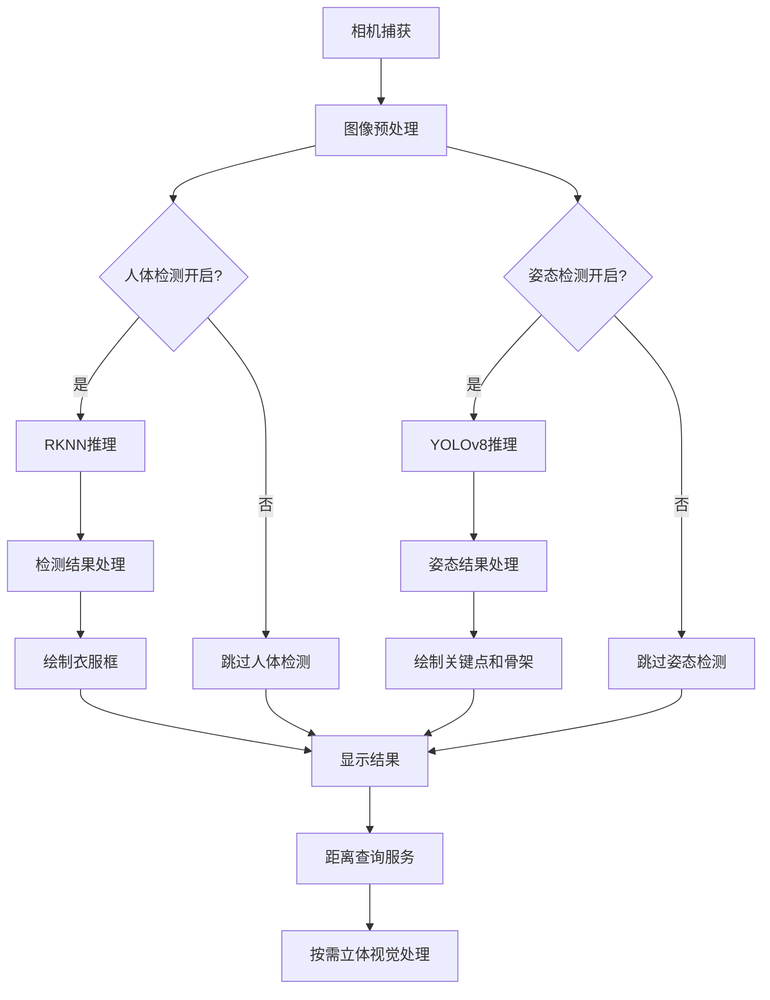

# 人体检测与姿态检测功能集成说明

## 📋 概述

本项目已成功将人体检测和姿态检测程序集成到 ROS2 Humble 双目立体视觉系统中。系统现在具备以下功能：

- ✅ **按需立体视觉处理**：只在距离查询服务调用时进行立体视觉计算
- ✅ **实时人体检测**：使用RKNN模型检测人体衣服并框定人体位置
- ✅ **衣服分类检测**：分别检测和框定上装（衣服）和下装（裤子）
- ✅ **人体姿态检测**：使用YOLOv8姿态检测模型进行17个关键点检测和骨架绘制
- ✅ **智能性能优化**：人体检测每5帧执行一次，姿态检测每8帧执行一次，平衡精度和性能
- ✅ **键盘交互控制**：支持实时功能开关和测试

## 🚀 快速开始

### 1. 编译项目
```bash
cd /userdata/try_again/SelfFollowingROS2
colcon build --packages-select following_robot
```

### 2. 启动节点
```bash
source install/setup.bash
ros2 run following_robot stereo_vision_node
```

### 3. 功能测试
节点启动后会显示相机画面，包含以下信息：
- 实时帧率 (FPS)
- 检测到的人体数量
- 检测到的衣服套数
- 检测到的姿态数量
- 立体视觉处理统计
- 人体检测调用次数
- 姿态检测调用次数
- 衣服和裤子的彩色检测框（蓝色-上装，红色-下装，绿色-整体人体）
- 人体姿态关键点和骨架（彩色显示）

## 🎮 键盘控制

| 按键 | 功能 |
|------|------|
| `q` | 退出程序 |
| `h` | 切换人体检测开关 |
| `p` | 切换姿态检测开关 |
| `s` | 手动触发立体视觉处理测试 |

## 🔧 技术架构

### 核心模块

1. **stereo_vision_node.py**
   - 主要的ROS2节点
   - 集成了人体检测和姿态检测功能
   - 提供距离测量服务

2. **rknn_colour_detect.py**
   - RKNN人体检测模块
   - 衣服颜色识别
   - 上装和下装分别检测
   - 人体位置框定

3. **yolov8_pose_detector.py**
   - YOLOv8姿态检测模块
   - 17个关键点检测
   - 骨架连接绘制
   - 支持多人姿态检测

4. **数据文件**
   - `data/best3.rknn`: 人体检测模型文件 (7.8MB)
   - `data/yolov8_pose.rknn`: 姿态检测模型文件 (5.0MB)

### 功能流程



## 🎨 检测框颜色编码

系统使用不同颜色的检测框来区分不同的检测对象：

| 颜色 | 检测对象 | 说明 |
|------|----------|------|
| 🔵 **蓝色** | 上装 (Upper) | 检测到的衣服、上衣、外套等 |
| 🔴 **红色** | 下装 (Lower) | 检测到的裤子、裙子、短裤等 |
| 🟢 **绿色** | 整体人体 (Person) | 根据上装和下装计算的整体人体框 |
| 🌈 **彩色** | 姿态关键点 | 17个人体关键点，每个关键点有不同颜色 |
| 🦴 **彩色骨架** | 骨架连接 | 连接关键点的骨架线条 |

### 显示信息
- **标签格式**：`Upper 1`, `Lower 1`, `Person 1`
- **颜色信息**：如果检测到颜色，会显示在标签后面
- **姿态信息**：显示检测到的姿态数量
- **实时统计**：画面左上角显示检测统计信息

## 📊 性能特性

### 优化策略
- **人体检测频率**：每5帧执行一次 (约12fps@60fps相机)
- **姿态检测频率**：每8帧执行一次 (约7.5fps@60fps相机)
- **立体视觉**：仅在距离查询时处理
- **内存管理**：优化图像拷贝和缓冲区使用
- **模型加载**：支持多路径自动查找

### 性能指标
- **相机帧率**：30-60 FPS (取决于硬件)
- **人体检测**：~12 FPS (每5帧一次)
- **姿态检测**：~7.5 FPS (每8帧一次)
- **立体处理**：按需执行 (通常<1秒)
- **CPU占用**：相比持续立体处理降低60-80%

## 🛠️ 配置说明

### 人体检测RKNN模型配置
```python
CONFIG = {
    'conf_threshold': 0.3,           # 检测置信度阈值
    'nms_confidence_threshold': 0.05, # NMS置信度阈值
    'nms_iou_threshold': 0.1,        # NMS IoU阈值
    'dominant_color_k': 4,           # 颜色聚类数量
    'detection_width': 640,          # 检测分辨率
    'detection_height': 640,         # 检测分辨率
}
```

### 姿态检测YOLOv8配置
```python
CONFIG = {
    'nms_thresh': 0.4,              # NMS阈值
    'object_thresh': 0.5,           # 目标检测阈值
    'input_size': (640, 640),       # 输入尺寸
    'keypoint_threshold': 0.5,      # 关键点置信度阈值
}
```

### 相机配置
```python
class StereoConfig:
    camera_id = 1                    # 相机设备ID
    frame_width = 1280              # 图像宽度
    frame_height = 480              # 图像高度
    fps_limit = 60                  # 帧率限制
```

## 🔍 故障排除

### 常见问题

1. **人体检测模型加载失败**
   ```
   E Invalid RKNN model path: ...
   ```
   **解决方案**：确认模型文件 `best3.rknn` 在 `data/` 目录中

2. **姿态检测模型加载失败**
   ```
   E 未找到YOLOv8姿态检测模型文件
   ```
   **解决方案**：确认模型文件 `yolov8_pose.rknn` 在 `data/` 目录中

3. **相机无法打开**
   ```
   错误：无法打开相机！
   ```
   **解决方案**：检查相机设备ID，尝试修改 `camera_id` 参数

4. **检测功能不工作**
   - 按 `h` 键确认人体检测已开启
   - 按 `p` 键确认姿态检测已开启
   - 检查RKNN模型是否正确加载
   - 确认相机画面中有人体

### 调试信息

启用详细日志：
```bash
export PYTHONPATH=/userdata/try_again/SelfFollowingROS2/src/following_robot:$PYTHONPATH
ros2 run following_robot stereo_vision_node --ros-args --log-level DEBUG
```

### 性能调优建议

1. **调整检测频率**
   - 人体检测：修改 `frame_counter % 5` 中的数值
   - 姿态检测：修改 `frame_counter % 8` 中的数值

2. **优化模型参数**
   - 调整置信度阈值以平衡精度和速度
   - 根据应用场景调整NMS参数

3. **硬件优化**
   - 确保RKNN NPU正常工作
   - 监控CPU和内存使用情况

## 📈 扩展功能

### 添加新的检测功能
1. 在相应的检测模块中添加新的检测函数
2. 在 `stereo_vision_node.py` 中集成调用
3. 更新键盘控制逻辑和显示信息

### 集成其他AI模型
- 支持添加更多RKNN模型
- 可扩展检测其他物体或特征
- 支持多模型并行推理

## 🔗 ROS2 服务接口

### 距离测量服务
```bash
# 服务名称
/stereo/get_distance

# 服务类型
custom_msgs/srv/GetDistance

# 调用示例
ros2 service call /stereo/get_distance custom_msgs/srv/GetDistance "{x: 320, y: 240}"
```

## 🧪 测试脚本

### 人体检测测试
```bash
python3 scripts/test_clothing_detection.py
```

### 姿态检测测试
```bash
python3 scripts/test_pose_detection.py
```

### 综合功能测试
```bash
python3 scripts/test_human_detection.py
```

## 📝 更新日志

### v1.2.0 (2025-06-27)
- ✅ 新增YOLOv8姿态检测功能
- ✅ 实现17个关键点检测和骨架绘制
- ✅ 添加姿态检测性能优化（每8帧处理一次）
- ✅ 完善键盘控制（新增'p'键切换姿态检测）
- ✅ 优化多模型并行处理架构

### v1.1.0 (2025-06-27)
- ✅ 新增衣服和裤子分别检测功能
- ✅ 实现彩色检测框显示（蓝色-上装，红色-下装，绿色-整体）
- ✅ 添加衣服检测详细统计信息
- ✅ 优化检测数据结构和显示逻辑

### v1.0.0 (2025-06-27)
- ✅ 成功集成 RKNN 人体检测功能
- ✅ 实现按需立体视觉处理
- ✅ 添加键盘交互控制
- ✅ 优化性能和资源使用
- ✅ 完善错误处理和日志记录

## 📞 技术支持

如有问题，请检查：
1. ROS2 Humble 环境是否正确配置
2. RKNN Lite 库是否已安装
3. 相机设备是否正常连接
4. 模型文件是否完整
5. 系统性能是否满足要求

### 模型文件检查
```bash
# 检查模型文件
ls -la data/
# 应该看到:
# best3.rknn (7.8MB) - 人体检测模型
# yolov8_pose.rknn (5.0MB) - 姿态检测模型
```

---

**项目状态**: ✅ 生产就绪  
**最后更新**: 2025-06-27  
**兼容性**: ROS2 Humble, RKNN Lite 2.x, OpenCV 4.x  
**支持功能**: 人体检测 + 衣服分类 + 姿态检测 + 立体视觉